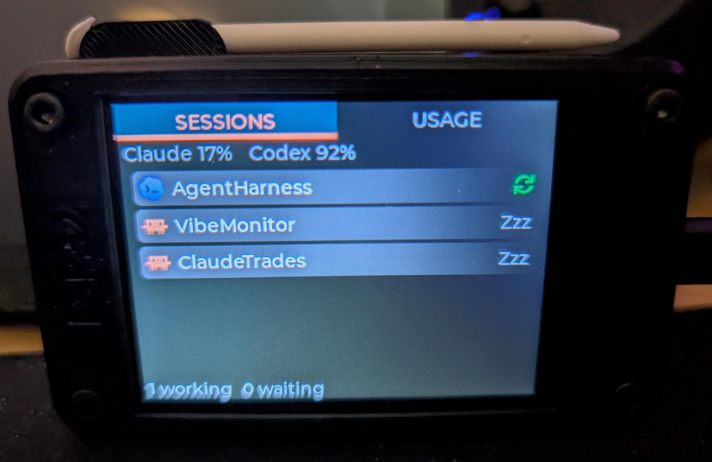
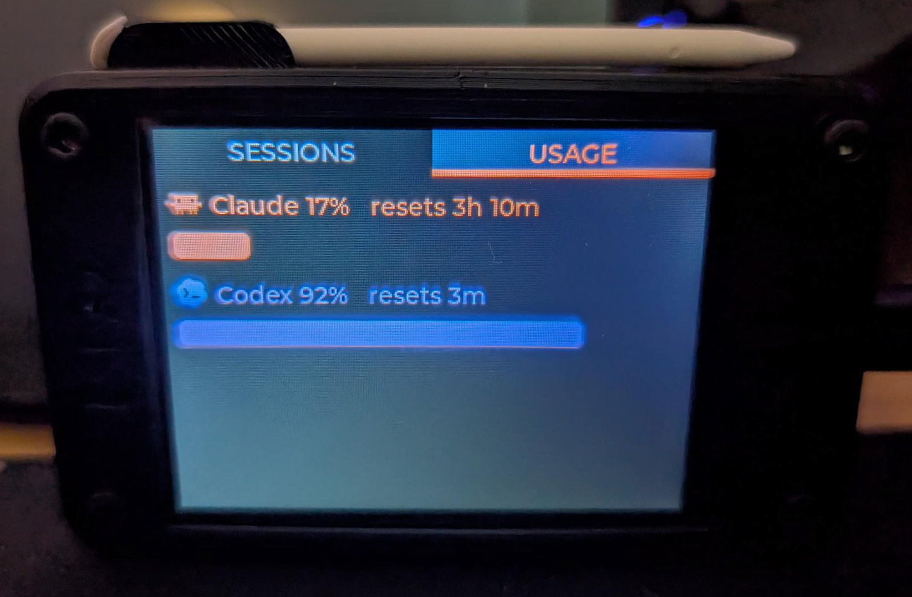

# VibeMonitor - ESP32 CYD Claude Code and Codex Session and Usage Montior

A tiny desk display for your Claude Code and OpenAI Codex CLI sessions — live usage gauges and an at-a-glance list of what every session is doing, with silent "needs you" alerts you dismiss by tapping the screen.

[](LICENSE)


<p align="center">
  
  &nbsp;
  
</p>
<p align="center"><sub><b>Sessions tab</b> — working / idle / waiting at a glance &nbsp;·&nbsp; <b>Usage tab</b> — Claude &amp; Codex usage % with reset countdowns</sub></p>

## What it does

VibeMonitor turns a ~$15 ESP32 touchscreen into an ambient status panel for your AI coding sessions:

- **Usage gauges** — your Claude usage % and reset countdown (plus Codex when available), so you can see how much headroom is left before a rate-limit window resets.
- **Live session list** — every active Claude Code and Codex session with a calm status symbol: **working** (actively running), **idle** (alive but quiet), or **waiting** (needs your input). Waiting sessions sort to the top and flash.
- **Tap-to-dismiss alerts** — when a session is waiting on you, its row flashes. Tap it to acknowledge and clear the highlight. No beeps, no LEDs — it's deliberately quiet.

## Architecture

VibeMonitor is two pieces: a small Python "bridge" that runs on your PC, and firmware on the ESP32 display. The bridge reads your local Claude/Codex state and serves it over your LAN; the device polls it about once every 1.5 seconds.

```
┌─ PC: VibeMonitor bridge (Python / Flask) ─────┐                ┌─ ESP32 "Cheap Yellow Display" ─┐
│                                                │                │  (Arduino + LVGL)              │
│  reads ~/.claude  ──► collector_claude ─┐      │   HTTP / LAN   │                                │
│  reads ~/.codex   ──► collector_codex  ─┼─► Store ─► hub ◄──────┤  GET /state   (~1.5 s poll)    │
│  usage probe      ──► usage / cache    ─┘         (Flask) ──────►  SESSIONS tab + USAGE tab      │
│                                                │   ───────────► │  POST /ack    (on tap)         │
│  Claude Code hook ──POST /hook──────────────►  │   X-VibeMonitor│                                │
└────────────────────────────────────────────────  -Token header └────────────────────────────────┘
```

Everything runs in one Python process in v1. The collector → hub split is a clean module boundary, so a second machine could later run only a collector that POSTs into the same hub.

## Hardware

VibeMonitor targets the **AITRIP ESP32-2432S028R**, commonly sold as the **"Cheap Yellow Display" (CYD)** — a 2.8", 320×240 resistive-touch TFT bonded to an ESP32, around $15. This is the exact unit used here: [Amazon — ASIN B0CKYVPWX9](https://www.amazon.com/dp/B0CKYVPWX9).

The device in the photos sits in a 3D-printed CYD case: [ESP32 CYD case on MakerWorld](https://makerworld.com/en/models/890009-esp32-cyd) (optional, but it makes a tidy desk toy).

> **Important board gotcha — ST7789, not ILI9341.** Many CYD guides assume an ILI9341 controller. This AITRIP variant uses the **ST7789** controller. Getting this wrong gives inverted colors or wrong geometry. The correct TFT_eSPI build flags (already set in `firmware/VibeMonitor/platformio.ini`) are:
>
> - `ST7789_DRIVER=1`
> - `TFT_INVERSION_OFF=1`
> - `TFT_RGB_ORDER=TFT_BGR`
> - `TFT_WIDTH=240`, `TFT_HEIGHT=320` (native portrait; `setRotation(1)` gives 320×240 landscape)
>
> These produce correct colors and geometry on this board. You should not need to change them.

## Repo layout

```
VibeMonitor/
  bridge/      Python/Flask bridge: reads ~/.claude + ~/.codex, serves /state, /ack, /hook
  firmware/    PlatformIO + LVGL app for the ESP32 CYD (plus a mock hub and a smoke test)
  icons/       Source Claude/Codex PNGs + make_lvgl_icons.py (generates firmware icons.c/.h)
  docs/        Screenshots and media
```

## Bridge setup (PC side)

Requires Python 3.11+ (uses `tomllib`).

```bash
cd bridge
python -m pip install -e ".[dev]"          # installs flask, requests; pytest for tests

cp config.example.toml config.toml          # then edit config.toml and set a random `token`
python -m vibemonitor.main config.toml       # starts the hub (default http://0.0.0.0:5151)
```

The Claude OAuth token used for the usage gauge is auto-read from `~/.claude/.credentials.json` on **Windows and Linux**; you only set `[claude] oauth_token` in `config.toml` to override it. On **macOS** Claude Code keeps that token in the system Keychain rather than a file, so the bridge can't auto-read it — set `[claude] oauth_token` manually there (see [Platform support](#platform-support)).

### Install the Claude Code hooks (instant "waiting" alerts)

The bridge ships a hook installer that **merges** into your existing `~/.claude/settings.json` (it backs the file up first and never clobbers your other hooks):

```bash
cd bridge
python hooks/install_hooks.py --token <same-token-as-config.toml> --url http://localhost:5151/hook
```

Restart Claude Code so it picks up the new hooks. This wires `Notification`, `Stop`, `UserPromptSubmit`, and `SessionStart` events to the bridge for instant, accurate "waiting" detection.

### Run the tests

```bash
cd bridge
python -m pytest -q
```

## Firmware setup (ESP32 CYD)

Requires [PlatformIO](https://platformio.org/) (the CLI or the VS Code extension).

```bash
cd firmware/VibeMonitor
pio run -e cyd -t upload          # build + flash over USB
```

On **first boot** the device starts a WiFi captive portal (SoftAP named `VibeMonitor-setup`). Join it from a phone or laptop and enter:

- your WiFi SSID + password,
- the **bridge host** (your PC's LAN IP),
- the **bridge port** (default `5151`),
- the **token** (the same value as `config.toml`).

These are stored in NVS (the token is obfuscated), so subsequent boots connect straight to WiFi. Holding the BOOT button (GPIO 0) at power-on triggers a factory reset back into the portal.

Build is PlatformIO + Arduino-ESP32 + LVGL 8.3 + TFT_eSPI, configured entirely via `build_flags` in `platformio.ini` (no `User_Setup.h` needed). See the [Hardware](#hardware) section for the ST7789 flags.

> Tip: `firmware/mock_hub/` is a tiny Flask server that serves canned `/state` fixtures, so you can develop the UI without a live bridge.

## Platform support

The bridge is pure Python and the firmware is built with PlatformIO, so both run on **Windows, macOS, and Linux**. The session list and Codex usage work the same everywhere; the only difference is how the Claude usage gauge gets its OAuth token:

| OS | Claude usage gauge | Notes |
|----|--------------------|-------|
| **Windows** | Auto — reads `%USERPROFILE%\.claude\.credentials.json` | Turnkey. |
| **Linux** | Auto — reads `~/.claude/.credentials.json` | Turnkey. |
| **macOS** | Manual — set `[claude] oauth_token` in `config.toml` | Claude Code stores the token in the Keychain, not a file, so the bridge can't auto-read it (yet). |

A few extra notes:

- **macOS token:** grab the value from the Keychain (Keychain Access → search "Claude", or `security find-generic-password -s "Claude Code-credentials" -w`) and paste it into `[claude] oauth_token`. The token rotates every few hours, so this is best treated as a temporary workaround until a native Keychain reader lands — contributions welcome.
- **Hook installer uses `python`.** If your macOS/Linux setup only has `python3` on `PATH`, the installed hook command will silently no-op (waiting status still works, just inferred from file activity instead of instant). Adjust the command in `~/.claude/settings.json` to `python3` if so.
- **`CLAUDE_CONFIG_DIR`:** if you've relocated your Claude config via this env var, the bridge currently still looks in the default `~/.claude` location.
- **Auto-start at login** is OS-specific and not bundled: Windows uses a Scheduled Task, macOS a `launchd` plist, Linux a `systemd --user` service. The bridge itself is just `python -m vibemonitor.main config.toml`.

## Data contract

All three endpoints require the header `X-VibeMonitor-Token: <token>` (a missing or wrong token returns `401`). The hub binds to the LAN; the token is the only gate, which is appropriate for a desk toy on a trusted network. No provider secrets are ever sent to the device — they stay on the PC.

### `GET /state`

Returns the current usage and the deduped, waiting-first session list (sessions past their TTL are already dropped server-side). `staleSec` is seconds since the last successful scan (`-1` before the first scan), so a stalled bridge is detectable from the device:

```json
{
  "ts": 1780000000,
  "usage": {
    "claude": { "ok": true,  "pct": 0.24, "window": "5h", "resetSec": 8040, "weekPct": 0.04 },
    "codex":  { "ok": false, "pct": null, "window": "5h", "resetSec": null, "weekPct": null }
  },
  "sessions": [
    { "id": "c21ef32d", "tool": "claude", "project": "WebApp",
      "status": "waiting", "ageSec": 3, "waiting": true, "count": 1 }
  ],
  "staleSec": 2
}
```

### `POST /ack`

```json
{ "id": "c21ef32d" }
```

Clears that session's waiting highlight (sent by the device when you tap a waiting row).

### `POST /hook`

```json
{ "id": "...", "project": "...", "tool": "claude", "event": "Notification", "ts": 1780000000 }
```

Received from the Claude Code hook; `event` is one of `Notification`, `Stop`, `UserPromptSubmit`, `SessionStart`.

## How status is determined

- **working** — the session's log file changed within `working_sec` (default 60s).
- **waiting** — the session is handing back to you. For **Claude**, this means a real
  permission/input prompt (the `Notification` hook); a finished turn (`Stop`) is treated as
  activity, not a waiting alert. For **Codex** (which has no "blocked on you" signal in its
  logs), a finished turn (`task_complete`) is shown as waiting. A waiting session is
  highlighted for `waiting_ttl_sec` (default 30 min), then quietly decays to idle — it is
  never pinned forever.
- **idle** — quiet, but not long enough to hide.
- **gone (hidden)** — quiet longer than `gone_ttl_sec` (default 4h); dropped from the list.

Tapping a waiting row on the device clears the alert for every window of that project.

Thresholds live in `config.toml` under `[thresholds]`.

## License

MIT — see [LICENSE](LICENSE). Copyright (c) 2026
